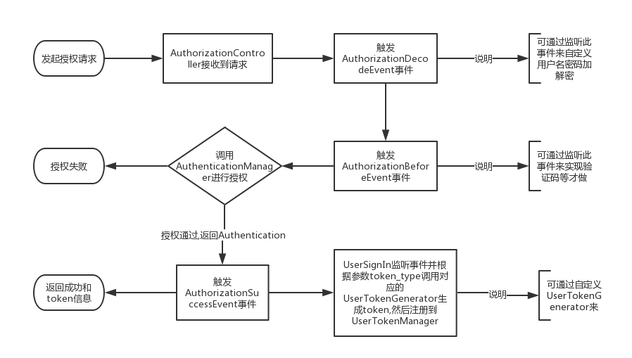
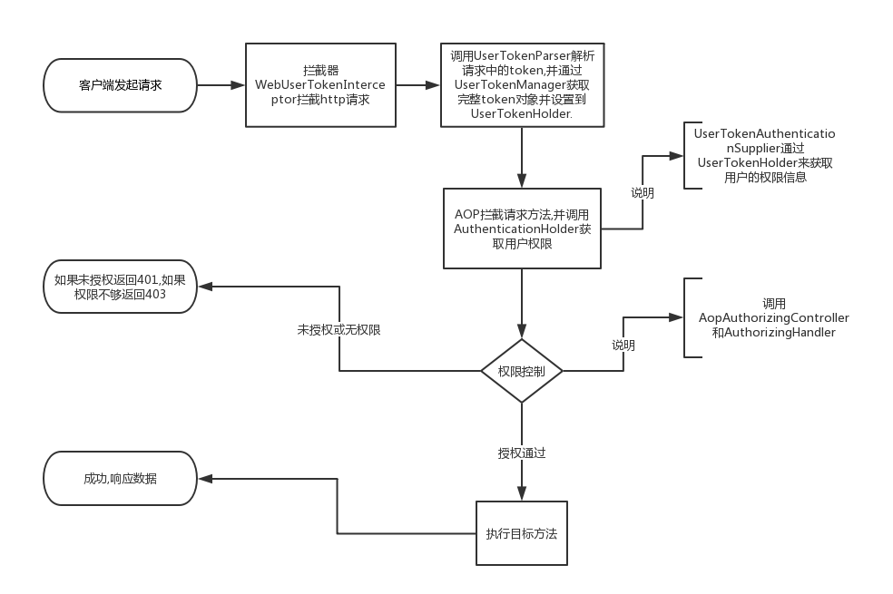

# 权限控制基础实现

1. 实现RBAC权限控制
2. 实现数据权限控制
3. 可动态进行权限配置设置


## 授权
使用`hsweb-authorization-api`提供的监听器,类`UserOnSignIn`监听用户授权事件`AuthorizationSuccessEvent`
当用户完成授权(授权方式可自行实现或者使用框架默认的授权方式,主要触发该事件即可).授权通过后会触发该事件.流程如下
1. 完成授权,触发`AuthorizationSuccessEvent`
2. `UserOnSignIn` 收到`AuthorizationSuccessEvent`事件,获取参数`token_type`(默认为`sessionId`),以及授权信息
3. 根据`token_type` 生成token.
4. 将token和授权信息中的userId注册到`UserTokenManager`
5. 将token返回给授权接口




## 权限控制
1. `AopAuthorizingController` aop拦截所有controller方法(注解了:`Controller`或者`RestController`的类的方法)
2. 在客户端发起请求的时候,将拦截到的方法信息(`MethodInterceptorContext`)传给权限定义解析器(`AopMethodAuthorizeDefinitionParser`)
进行解析
3. 框架默认实现的解析器会先调用所有的`AopMethodAuthorizeDefinitionCustomizerParser`获取自定义的配置(实现`AopMethodAuthorizeDefinitionCustomizerParser`接口并注入到spring即可,自定义未进行缓存,请自行实现缓存策略)
如果没有,则获取缓存,如果缓存不存在就开始解析方法以及类上的注解,并放入缓存后返回权限配
4. 如果解析器返回的结果不为空,并且用户已经登录,则调用`AuthorizingHandler`进行权限控制
5. 默认的权限控制实现`DefaultAuthorizingHandler`,将分别进行RBAC,数据权限,表达式方式的权限控制.
6. 如果授权未通过,则抛出`AccessDenyException`异常




## 双重验证

配置 application.yml
```yml
hsweb:
    authorize:
        two-factor:
            enable: true
```

在需要验证的接口上注解:

```java
@PostMapping
@TwoFactor("update-password")
public ResponseMessage<Boolean> updatePassword(String password){
    
    //
}
```

## 注销
与授权同理,类`UserOnSignOut`监听`AuthorizationExitEvent` ,当触发事件后,调用`UserTokenManager`移除当前登录的token信息

## rbac权限控制
默认对注解`Authorize`进行实现,具体功能,请查看源代码

## 数据权限
原理: 通过用户的权限信息,对aop拦截到的参数进行操作

约束: 对方法的参数有要求,如动态查询需要有参数`QueryParamEntity`,controller需要实现`hsweb-commons-controller`中提供的通用controller等

例如:用户设置了 机构管理权限(org)只能查询(query)自己和下属的机构.
通过获取拦截到方法的动态查询参数`QueryParamEntity`,对参数进行重构,
客户端的查询条件翻译为sql:
```sql
where name like ? or full_name like
```     
     
重构后为:
```sql
--u_id in (用户可访问的机构id)
where u_id in(?,?,?) and (name like ? or full_name like)
```

## 授权登录接口
http接口: `POST /authorize/login`, 登录接口支持2种`content-type`,`application/json`(Json RequestBody方式)和`application/x-www-form-urlencoded`(表单方式),
请在调用等时候指定对应等`content-type`.必要参数: `username` 和 `password`.

⚠️注意: 此接口只实现了简单的登录逻辑,不过会通过发布各种事件来实现自定义的逻辑处理.

1. `AuthorizationDecodeEvent` 在接收到登录请求之后触发,如果在登录前对用户名密码进行里加密,可以通过监听此事件实现对用户名密码的解密操作
2. `AuthorizationBeforeEvent` 在`AuthorizationDecodeEvent`事件完成后触发,可通过监听此事件并获取请求参数,实现验证码功能
3. `AuthorizationSuccessEvent` 在授权成功后触发.注意: 权限控制模块也是通过监听此事件来完成授权
4. `AuthorizationFailedEvent` 授权失败时触发.当发生过程中异常时触发此事件

什么? 还不知道如何监听事件? [快看这里](https://github.com/hs-web/hsweb-framework/wiki/事件驱动)

# 会话状态
此模块默认使用sessionId绑定用户信息。还可以使用 [jwt](../hsweb-authorization-jwt) 方式
