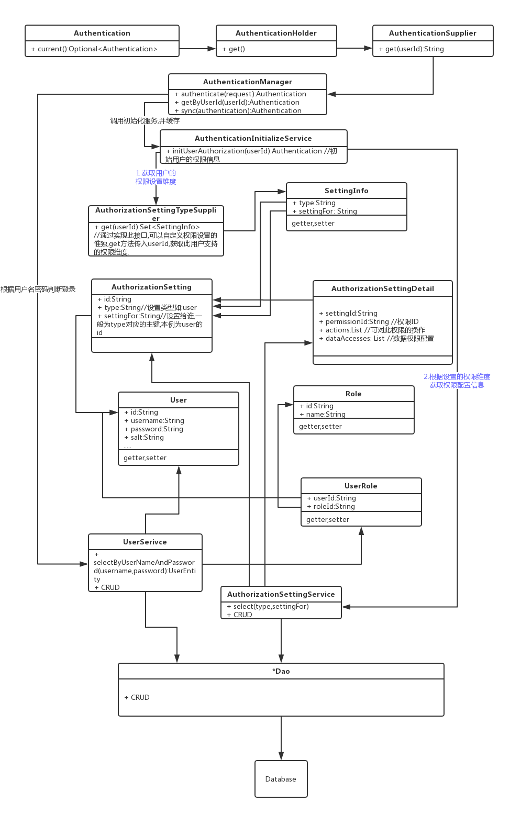

## 权限功能模块

1. 提供用户,角色管理等基础功能
2. 提供统一的多维度,可拓展的权限分配

        权限设置不再像以往那样和角色,用户直接关联.在此模块里,权限设置是通用的.
        你可以为用户,角色,自己定义的维度比如:机构,部门,岗位等维度进行权限分配.
        而且不仅仅支持基本等RBAC权限控制,还可以自定义控制到数据行和列.
        
3. 提供系统菜单管理
        
## 使用
引入依赖到`pom.xml`
```xml
<dependency>
    <groupId>org.hswebframework.web</groupId>
    <artifactId>hsweb-system-authorization-starter</artifactId>
    <version>${hsweb.framework.version}</version>
</dependency>
```

## 结构
 

