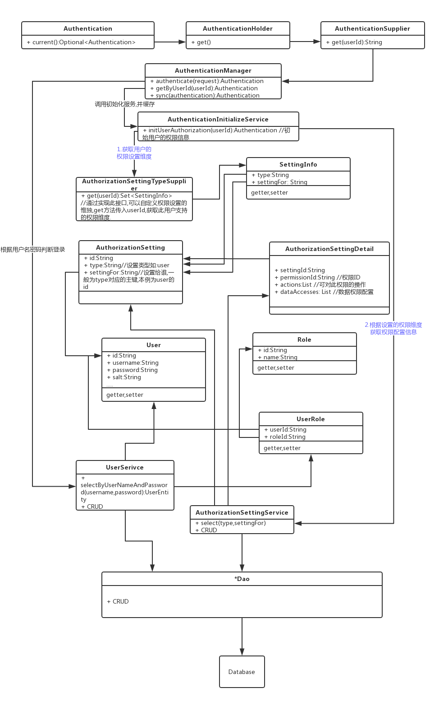

## 权限功能模块

1. 提供用户,角色管理等基础功能
2. 提供统一的多维度,可拓展的权限分配

        权限设置不再像以往那样和角色,用户直接关联.在此模块里,权限设置是通用的.
        你可以为用户,角色,自己定义的维度比如:机构,部门,岗位等维度进行权限分配.
        而且不仅仅支持基本等RBAC权限控制,还可以自定义控制到数据行和列.
        
3. 提供系统菜单管理
        
## 使用
引入依赖到`pom.xml`
```xml
<dependency>
    <groupId>org.hswebframework.web</groupId>
    <artifactId>hsweb-system-authorization-starter</artifactId>
    <version>${hsweb.framework.version}</version>
</dependency>
```

## 结构
 


## 统一认证的用户状态

`DefaultReactiveAuthenticationManager#getByUserId` 在认证缓存加载时校验用户状态：
只有启用的用户才初始化认证，停用或不存在的用户返回空结果。无缓存时使用同一加载逻辑。
状态变更需要在事务提交后发布 `ClearUserAuthorizationCacheEvent`，随后访问按最新状态重新加载。

缓存命中不增加用户查询。启用用户的冷加载增加一次状态查询，随后沿用
`ReactiveAuthenticationInitializeService#initUserAuthorization(String)`；不改变初始化接口、事件和内部权限信息初始化语义。
该校验不取消已有在途请求。Guava、Caffeine 本地缓存会阻止失效时已撤销的加载者重新回填，
其后续完成或失败也不会清除新的加载者和缓存值。Redis 同节点异步写入及跨节点写入与失效
不提供同样的原子保证；`clear` 不提供全缓存事务。

状态校验仅作用于默认认证管理器；其他认证 Provider 仍按自身契约提供认证，
默认管理器返回空不会阻止其他 Provider 返回认证。
通过默认管理器使用自定义 initializer 时，也需要存在且启用的持久用户；
直接由独立 Token Provider 创建的机器身份不经过该用户加载入口。
