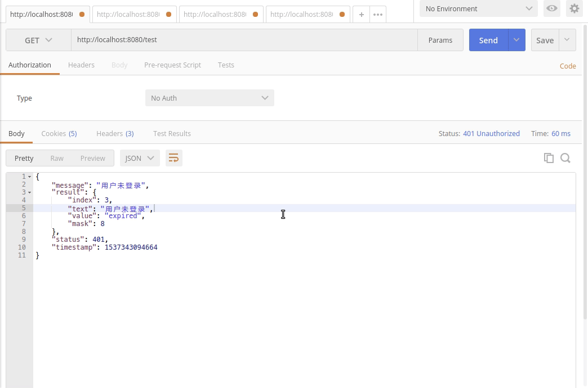

# 权限控制

hsweb提供了一个灵活的权限控制,设置方式,实现了多维度,可自定义的RBAC和数据权限控制.

## 使用

以下例子在[快速入门](README.md)的基础上建立

1. 引入依赖
```xml
    <!--权限控制-->
    <dependency>
        <groupId>org.hswebframework.web</groupId>
        <artifactId>hsweb-authorization-basic</artifactId>
        <version>${hsweb.framework.version}</version>
    </dependency>
```

2. 在启动类上注解:`@EnableAopAuthorize`
```java
@SpringBootApplication
@MapperScan(basePackages = "com.mycompany.dao", markerInterface = Dao.class)
@EnableAopAuthorize //开启AOP权限控制
public class MyProjectApplication {

    public static void main(String[] args) {
        SpringApplication.run(MyProjectApplication.class, args);
    }
}
```

3. 在`application.yml`中加入配置
```yaml
hsweb:
    users:
        admin:
          name: 超级管理员
          username: admin
          password: admin
          roles: #用户的角色
            - id: admin
              name: 管理员
            - id: user
              name: 用户
          permissions:  # 用户的权限
            - id: test #权限标识,可以理解为资源
              actions: query,get,update,delete #用户持有对该资源的操作
              dataAccesses:   # 数据权限配置,此配置表示在对test进行query操作的时候,不能查询password和salt字段
                - action: query
                  type: DENY_FIELDS
                  fields:     
                    - password
                    - salt
```

4. 在`TestController`中加入权限控制,在类上注解`@Authorize(permission = "test")`

```java
@RestController
@RequestMapping("/test")
@Authorize(permission = "test")
public class TestController implements SimpleGenericEntityController<TestEntity, String, QueryParamEntity> {

    @Autowired
    TestService testService;

    @Override
    public CrudService<TestEntity, String> getService() {
        return testService;
    }
}
```

5. 启动服务,使用postman访问:`GET http://localhost:8080/test`.返回
```json
{
    "message": "用户未登录",
    "result": {
        "index": 3,
        "text": "用户未登录",
        "value": "expired",
        "mask": 8
    },
    "status": 401,
    "timestamp": 1537342065201
}
```

6. 调用登录接口登录`POST http://localhost:8080/authorize/login`

username=admin&password=admin

返回:
```json
{
    "result": {
        "userId": "admin"
    },
    "status": 200,
    "timestamp": 1537342179265
}
```

7.再次访问`GET http://localhost:8080/test`.返回正常数据.

通过接口`GET http://localhost:8080/authorize/me`可查看当前登录用户的权限信息.

通过接口`GET http://localhost:8080/authorize/exit`可退出登录.




# 编程式

可通过在Controller方法参数中直接注入`org.hswebframework.web.authorization.Authentication`接口获取当前登录用户权限信息.
也可以通过静态方法方式获取:

```java
Authentication authentication= Authentication.current().orElseThrow(UnAuthorizedException::new);
```

可调用此接口的方法进行用户权限获取以及判断:
```java
//用户是否可以进行test的query操作
authentication.hasPermission("test", "query");

//用户是否拥有admin角色
authentication.hasRole("admin");

//获取用户在进行test的query操作时,不能操作的字段列表
Set<String> denyFiledList= authentication.getPermission("test")
            .map(permission->permission.findDenyFields("query"))
            .orElseThrow(AccessDenyException::new);

//获取用户在进行test的query操作时,能访问部门(department)(含子部门(children))数据的范围
Set<Object> canQueryDepartment= authentication.getPermission("test")
            .map(permission->permission.findScope("query","department","children"))
            .orElseThrow(AccessDenyException::new);

```

# 使用数据库来维护用户以及权限信息

在上述说明中是通过配置文件来进行用户以及权限配置的,在hsweb-system模块中还提供了使用数据库来来进行更灵活的权限信息配置

[请看这里](../hsweb-system/hsweb-system-authorization)

# 会话状态

默认使用`sessionId`来作为用户的`token`,你也可以通过拓展来实现自定义的`token`策略:

[请看这里](https://github.com/hs-web/hsweb-framework/wiki/autz#%E8%87%AA%E5%AE%9A%E4%B9%89token%E7%AD%96%E7%95%A5%E5%AE%9E%E7%8E%B0%E5%89%8D%E5%90%8E%E5%88%86%E7%A6%BB)