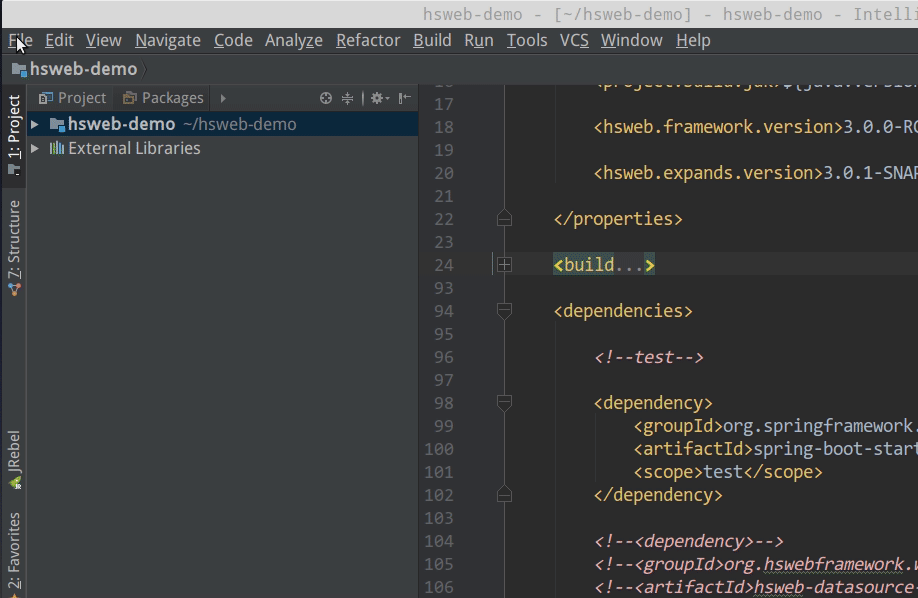
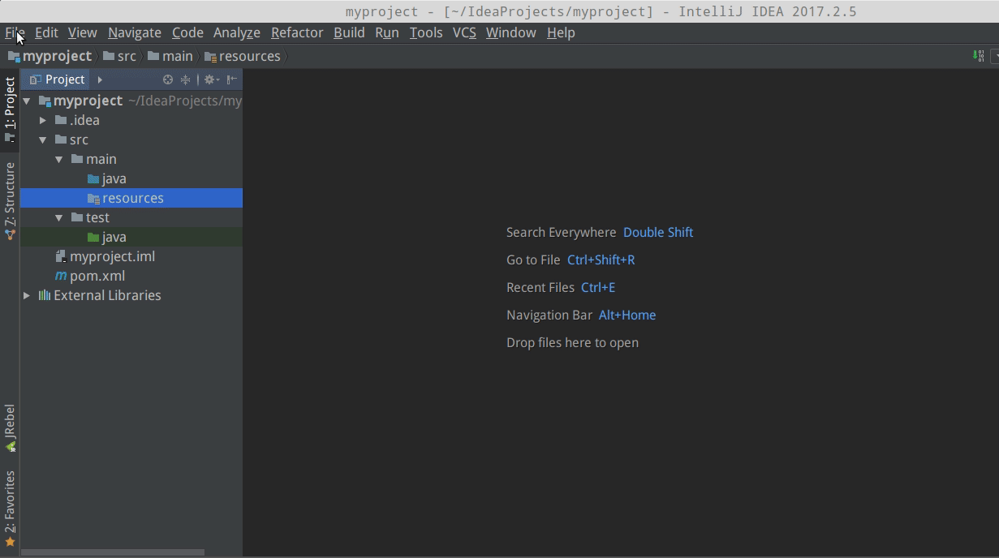
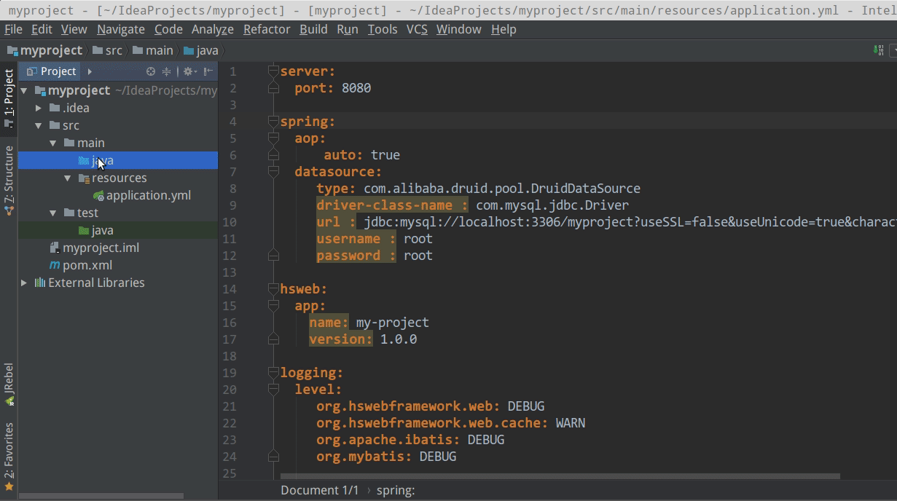
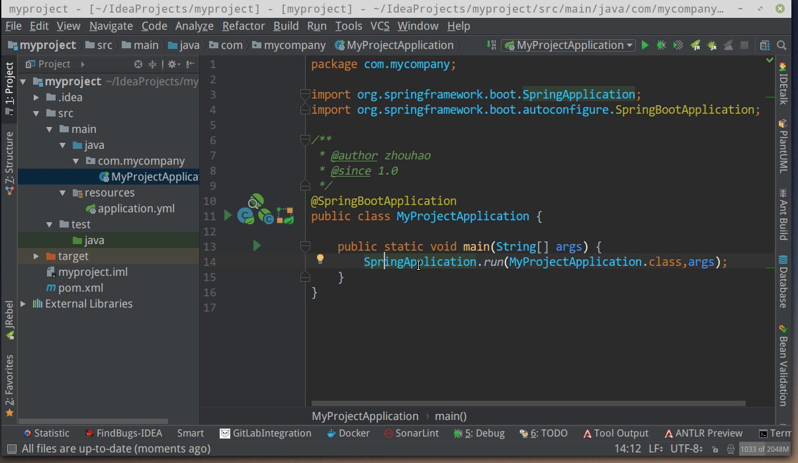
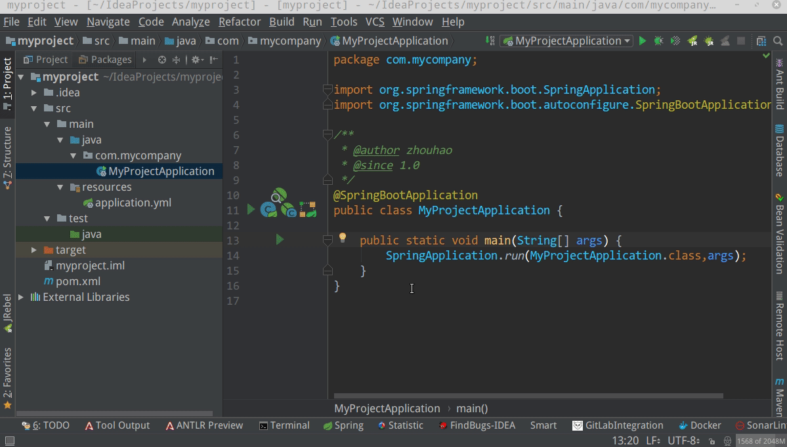
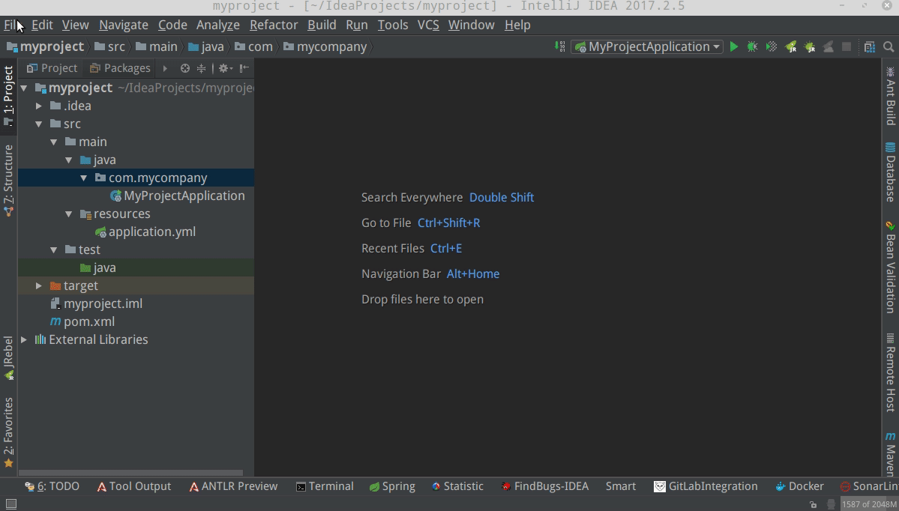
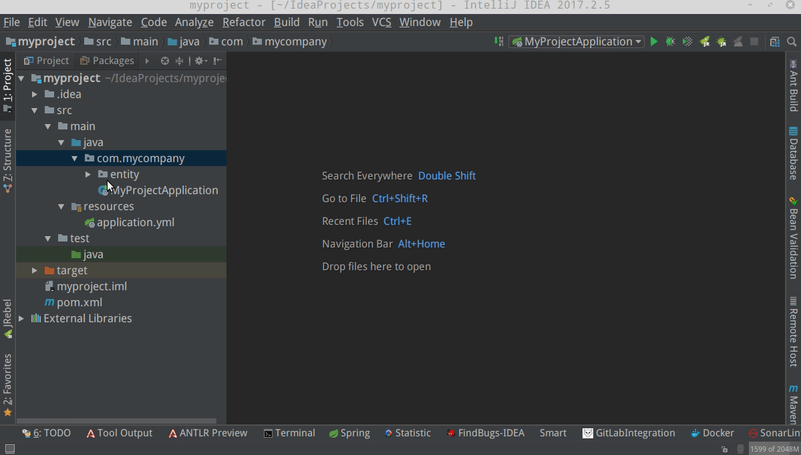
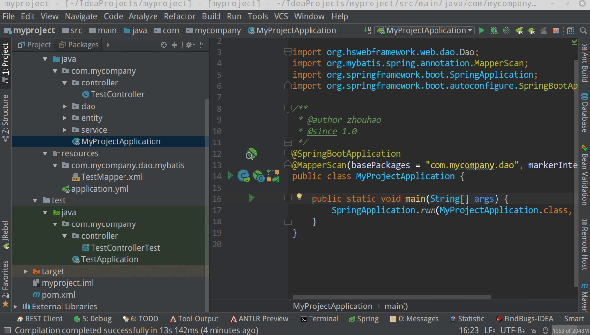

# 快速入门

本文提供了最基本的hsweb使用方式,只要认真阅读本文,创建一个项目不成问题.

## 目录
1. [前言](#前言)
2. [创建项目](#创建项目)
3. [增删改查](#增删改查)
4. [更多教程](#更多教程)

## 前言
`hsweb`是基于`java8`,`spring-boot`,`mybatis`开发.所以在开始使用`hsweb`的前,你至少应该掌握以下技术:`java`,`maven`.
最好掌握以下技术:`spring-boot`,`mybatis`. 如果对以上技术一无所知,请先去各大搜索引擎学习之. 

`hsweb`是一个模块化的项目,对各个功能进行了细分,这是为了更好的拓展性,但是在实际业务项目中,并不需要这样的细分,因此,强烈不建议自己直接将hsweb-framework clone下来在上面添加业务代码,正确的姿势是使用maven,根据自己的需求依赖hsweb的各个模块. 

hsweb 目前未提供前端支持,仅有一个[demo](https://github.com/hs-web/hsweb3-demo)可供参考.

本入门教程以一个最传统的单模块项目为例子. IDE为:`Intellij IDEA`(需安装lombok插件)

## 创建项目
1. 新建maven项目:



编辑`pom.xml`,然后`reimport`.如果对maven不够熟悉,maven的设置请使用默认设置,不要在settings.xml里自己添加私服.
否则可能出现依赖无法下载的问题.

```xml
<?xml version="1.0" encoding="UTF-8"?>
<project xmlns="http://maven.apache.org/POM/4.0.0"
         xmlns:xsi="http://www.w3.org/2001/XMLSchema-instance"
         xsi:schemaLocation="http://maven.apache.org/POM/4.0.0 http://maven.apache.org/xsd/maven-4.0.0.xsd">
    <modelVersion>4.0.0</modelVersion>

    <groupId>com.mycompany</groupId>
    <artifactId>myproject</artifactId>
    <version>1.0-SNAPSHOT</version>
    <properties>
        <project.build.sourceEncoding>UTF-8</project.build.sourceEncoding>
        <project.build.locales>zh_CN</project.build.locales>
        <spring.boot.version>1.5.13.RELEASE</spring.boot.version>

        <java.version>1.8</java.version>
        <project.build.jdk>${java.version}</project.build.jdk>

        <hsweb.framework.version>3.0.0</hsweb.framework.version>

        <hsweb.expands.version>3.0.1</hsweb.expands.version>


    </properties>

    <build>
        <finalName>${project.artifactId}</finalName>
        <resources>
            <resource>
                <directory>src/main/resources</directory>
                <filtering>true</filtering>
            </resource>
        </resources>
        <plugins>
            <!--编译插件-->
            <plugin>
                <groupId>org.apache.maven.plugins</groupId>
                <artifactId>maven-compiler-plugin</artifactId>
                <version>3.1</version>
                <!--指定编译器版本和字符集-->
                <configuration>
                    <source>${project.build.jdk}</source>
                    <target>${project.build.jdk}</target>
                    <encoding>${project.build.sourceEncoding}</encoding>
                </configuration>
            </plugin>

            <!--
            spring-boot插件
            1. 可以使用命令 mvn spring-boot:run 直接运行项目
            2. 使用mvn package命令打包为可执行jar,通过jar -jar 运行项目
            -->
            <plugin>
                <groupId>org.springframework.boot</groupId>
                <artifactId>spring-boot-maven-plugin</artifactId>
                <version>${spring.boot.version}</version>
                <configuration>
                    <!--启动类-->
                    <mainClass>com.mycompany.MyProjectApplication</mainClass>
                    <layout>ZIP</layout>
                </configuration>
                <executions>
                    <execution>
                        <goals>
                            <goal>repackage</goal>
                        </goals>
                    </execution>
                </executions>
            </plugin>

        </plugins>
    </build>

    <dependencies>

        <!--test-->
        <dependency>
            <groupId>org.springframework.boot</groupId>
            <artifactId>spring-boot-starter-test</artifactId>
            <scope>test</scope>
        </dependency>
        <dependency>
            <groupId>org.hswebframework.web</groupId>
            <artifactId>hsweb-tests</artifactId>
            <version>${hsweb.framework.version}</version>
            <scope>test</scope>
        </dependency>
        <!--必须要引入的依赖-->
        
        <!--对spring-cache一些问题的修复-->
        <dependency>
            <groupId>org.hswebframework.web</groupId>
            <artifactId>hsweb-concurrent-cache</artifactId>
            <version>${hsweb.framework.version}</version>
        </dependency>
        
        <!--spring-boot-starter-->
        <dependency>
            <groupId>org.hswebframework.web</groupId>
            <artifactId>hsweb-spring-boot-starter</artifactId>
        </dependency>

        <dependency>
            <groupId>org.springframework.boot</groupId>
            <artifactId>spring-boot-starter-logging</artifactId>
        </dependency>
        
        <dependency>
            <groupId>org.codehaus.groovy</groupId>
            <artifactId>groovy-all</artifactId>
        </dependency>

        <dependency>
            <groupId>mysql</groupId>
            <artifactId>mysql-connector-java</artifactId>
            <version>5.1.40</version>
        </dependency>

        <dependency>
            <groupId>com.alibaba</groupId>
            <artifactId>druid</artifactId>
        </dependency>

        <dependency>
            <groupId>ch.qos.logback</groupId>
            <artifactId>logback-classic</artifactId>
        </dependency>

        <dependency>
            <groupId>org.slf4j</groupId>
            <artifactId>slf4j-api</artifactId>
        </dependency>
        
        <dependency>
            <groupId>org.springframework.boot</groupId>
            <artifactId>spring-boot-configuration-processor</artifactId>
            <optional>true</optional>
        </dependency>
        
        <dependency>
            <groupId>org.projectlombok</groupId>
            <artifactId>lombok</artifactId>
        </dependency>

        <!--以下为可选依赖-->
        
        
    </dependencies>

    <!--统一依赖管理-->
    <dependencyManagement>
        <dependencies>
            <dependency>
                <groupId>org.hswebframework.web</groupId>
                <artifactId>hsweb-framework</artifactId>
                <version>${hsweb.framework.version}</version>
                <type>pom</type>
                <scope>import</scope>
            </dependency>
            
            <dependency>
                <groupId>com.alibaba</groupId>
                <artifactId>druid</artifactId>
                <version>1.0.26</version>
            </dependency>

            <dependency>
                <groupId>org.hswebframework.web</groupId>
                <artifactId>hsweb-spring-boot-starter</artifactId>
                <version>${hsweb.framework.version}</version>
            </dependency>

        </dependencies>

    </dependencyManagement>
    <!--pom里引入私服,无需再到 settings.xml中配置-->
    <repositories>
        <repository>
            <id>hsweb-nexus</id>
            <name>Nexus Release Repository</name>
            <url>http://nexus.hsweb.me/content/groups/public/</url>
            <snapshots>
                <enabled>true</enabled>
                 <updatePolicy>always</updatePolicy>
            </snapshots>
        </repository>
        <repository>
            <id>aliyun-nexus</id>
            <name>aliyun</name>
            <url>http://maven.aliyun.com/nexus/content/groups/public/</url>
        </repository>
    </repositories>

    <pluginRepositories>
        <pluginRepository>
            <id>aliyun-nexus</id>
            <name>aliyun</name>
            <url>http://maven.aliyun.com/nexus/content/groups/public/</url>
        </pluginRepository>
    </pluginRepositories>
    
</project>
```

2. 在`resources`中创建`application.yml`配置



```yaml
server:
  port: 8080

spring:
  aop:
      auto: true
  datasource:
     type: com.alibaba.druid.pool.DruidDataSource
     driver-class-name : com.mysql.jdbc.Driver
     url : jdbc:mysql://localhost:3306/myproject?useSSL=false&useUnicode=true&characterEncoding=utf8&autoReconnect=true&failOverReadOnly=false
     username : root
     password : root

hsweb:
  app:
    name: my-project
    version: 1.0.0

logging:
  level:
     org.hswebframework.web: DEBUG
     org.hswebframework.web.cache: WARN
     org.apache.ibatis: DEBUG
     org.mybatis: DEBUG
```

3. 创建启动类


```java
package com.mycompany;

import org.springframework.boot.SpringApplication;
import org.springframework.boot.autoconfigure.SpringBootApplication;

/**
 * @author zhouhao
 * @since 1.0
 */
@SpringBootApplication
public class MyProjectApplication {

    public static void main(String[] args) {
        SpringApplication.run(MyProjectApplication.class,args);
    }
}
```

4. 创建数据库
```sql
    CREATE DATABASE IF NOT EXISTS myproject default charset utf8 COLLATE utf8_general_ci; 
```

5. 执行`MyProjectApplication.main`启动应用


打开浏览器访问 http://localhost:8080. 提示`Whitelabel Error Page`则说明服务启动成功.
因为现在还没有任何功能,所有提示错误信息.

到此,项目建立完成,和普通的spring-boot项目没有区别.


## 增删改查

使用通用CURD,添加一个增删改查功能:
 
在`pom.xml`中引入模块:
```xml
<!--通用CRUD-->
<dependency>
    <groupId>org.hswebframework.web</groupId>
    <artifactId>hsweb-commons-dao-mybatis</artifactId>
    <version>${hsweb.framework.version}</version>
</dependency>
<dependency>
    <groupId>org.hswebframework.web</groupId>
    <artifactId>hsweb-commons-service-simple</artifactId>
    <version>${hsweb.framework.version}</version>
</dependency>
<dependency>
    <groupId>org.hswebframework.web</groupId>
    <artifactId>hsweb-commons-controller</artifactId>
    <version>${hsweb.framework.version}</version>
</dependency>
```




1. 创建数据库表:

```sql
    create table tb_test(
        id varchar(32) primary key,
        name varchar(32) not null,
        status tinyint,
        comment text
    )
```

2. 创建实体类 `com.mycompany.entity.TestEntity`

实体类可通过继承:`org.hswebframework.web.commons.entity.SimpleGenericEntity<主键类型>`.来使用通用的crud功能.

```java
@Getter
@Setter
public class TestEntity extends SimpleGenericEntity<String> {
    private String name;

    private Byte status;

    private String comment;
}

```



3. 创建Dao 

dao接口可通过继承:`org.hswebframework.web.dao.CrudDao<实体类,主键类型>`.来使用通用的crud功能.

创建Dao接口 `com.mycompany.dao.TestDao`

```java
public interface TestDao extends CrudDao<TestEntity,String> {

}
```



创建myabtis mapper,在`resources`目录上创建:`com/mycompany/dao/mybatis/TestMapper.xml`,注意: 目录分割使用`/`而不是`.`

```xml
<?xml version="1.0" encoding="UTF-8" ?>
<!DOCTYPE mapper
        PUBLIC "-//mybatis.org//DTD Mapper 3.0//EN"
        "http://www.mybatis.org/dtd/mybatis-3-mapper.dtd">
<mapper namespace="com.mycompany.dao.TestDao">
    <resultMap id="TestEntityResultMap" type="com.mycompany.entity.TestEntity">
        <!--必须列出映射关系-->
        <id property="id" column="id" javaType="String" jdbcType="VARCHAR"/>
        <result property="name" column="name" javaType="String" jdbcType="VARCHAR"/>
        <result property="status" column="status" javaType="Byte" jdbcType="TINYINT"/>
        <result property="comment" column="comment" javaType="String" jdbcType="CLOB"/>
    </resultMap>

    <!--用于动态生成sql所需的配置-->
    <sql id="config">
        <bind name="resultMapId" value="'TestEntityResultMap'"/>
        <bind name="tableName" value="'tb_test'"/>
    </sql>

    <insert id="insert" parameterType="com.mycompany.entity.TestEntity" >
        <include refid="config"/>
        <include refid="BasicMapper.buildInsertSql"/>
    </insert>

    <delete id="deleteByPk" parameterType="String">
        delete from tb_test where id =#{id}
    </delete>

    <delete id="delete" parameterType="org.hswebframework.web.commons.entity.Entity">
        <include refid="config"/>
        <include refid="BasicMapper.buildDeleteSql"/>
    </delete>

    <update id="update" parameterType="org.hswebframework.web.commons.entity.Entity">
        <include refid="config"/>
        <include refid="BasicMapper.buildUpdateSql"/>
    </update>

    <select id="query" parameterType="org.hswebframework.web.commons.entity.Entity" resultMap="TestEntityResultMap">
        <include refid="config"/>
        <include refid="BasicMapper.buildSelectSql"/>
    </select>

    <select id="count" parameterType="org.hswebframework.web.commons.entity.Entity" resultType="int">
        <include refid="config"/>
        <include refid="BasicMapper.buildTotalSql"/>
    </select>
</mapper>

```


在`application.yml`中添加配置:

```yaml
mybatis:
  mapper-locations: classpath:com/mycompany/dao/mybatis/**/*.xml
```

在`MyProjectApplication`上添加注解:`@MapperScan(basePackages = "com.mycompany.dao", markerInterface = org.hswebframework.web.dao.Dao.class)`


4. 创建Service

service接口可通过继承:`org.hswebframework.web.service.CrudService<实体类,主键类型>`.来使用通用的crud功能.

创建接口类: `com.mycompany.service.TestService`

```java
public interface TestService extends CrudService<TestEntity,String> {
}

```

实现类可通过继承: ` org.hswebframework.web.service.GenericEntityService<实体类,主键类型>`.来使用通用crud功能.

创建实现类 `com.mycompany.service.impl.TestServiceImpl` 
 
```java
@Service
public class TestServiceImpl extends GenericEntityService<TestEntity,String>
        implements TestService {

    @Autowired
    private TestDao testDao;

    @Override
    protected IDGenerator<String> getIDGenerator() {
        return IDGenerator.MD5;
    }

    @Override
    public TestDao getDao() {
        return testDao;
    }
}
```


5. 创建Controller

controller 可通过实现接口: `org.hswebframework.web.controller.SimpleGenericEntityController<实体类,主键类型,org.hswebframework.web.commons.entity.param.QueryParamEntity>`

创建controller类: `com.mycompany.controller.TestController`

```java

@RestController
@RequestMapping("/test")
public class TestController implements SimpleGenericEntityController<TestEntity, String, QueryParamEntity> {

    @Autowired
    TestService testService;

    @Override
    public CrudService<TestEntity, String> getService() {
        return testService;
    }
}

```

6. 测试

方式一:编写单元测试

在src/test/groovy目录下创建`com.mycompany.TestApplication.java`和`com.mycompany.controller.TestControllerTest.groovy`

```java
@SpringBootApplication
@WebAppConfiguration
public class TestApplication {

}
```

```groovy
@WebAppConfiguration
@ContextConfiguration
@SpringBootTest(classes = [TestApplication.class], properties = ["classpath:application.yml"])
class TestControllerTest extends Specification {
    @Autowired
    private ConfigurableApplicationContext context;

    @Shared
    private MockMvc mockMvc;

    void setup() {
        mockMvc = MockMvcBuilders.webAppContextSetup(context).build();
    }

    def "Test Create Data"() {
        setup:
        def testData = """
            {"name":"测试数据","status":1,"comment":"说明"}
            """
        and:
        mockMvc.perform(
                post("/test")
                        .contentType(MediaType.APPLICATION_JSON)
                        .content(testData)
        ).andExpect(status().is(201))

    }
}
```
执行单元测试,通过则说明新增功能测试通过.

方式二: `postman` 或者idea的`Test Restful Web Servcice`,以Idea工具为例:

执行启动类:`com.mycompany.MyProjectApplication`启动服务,然后调用`/test`服务



一个最简单的通用crud例子完成了!! 

## 获取例子的完整源代码
[myproject](https://github.com/hs-web/hsweb-examples/tree/master/myproject)

## 更多教程

[通用增删改查使用](USE-CRUD.md) ,[拓展系统自带功能的字段](CUSTOM-PROP.md) [权限控制](AUTZ.md) ,[业务功能](SYSTEM.md) , [实用工具包](UTILS.md)

[常见问题及解决方式](https://github.com/hs-web/hsweb-framework/issues/97)

 

